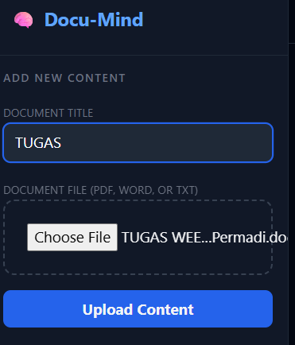
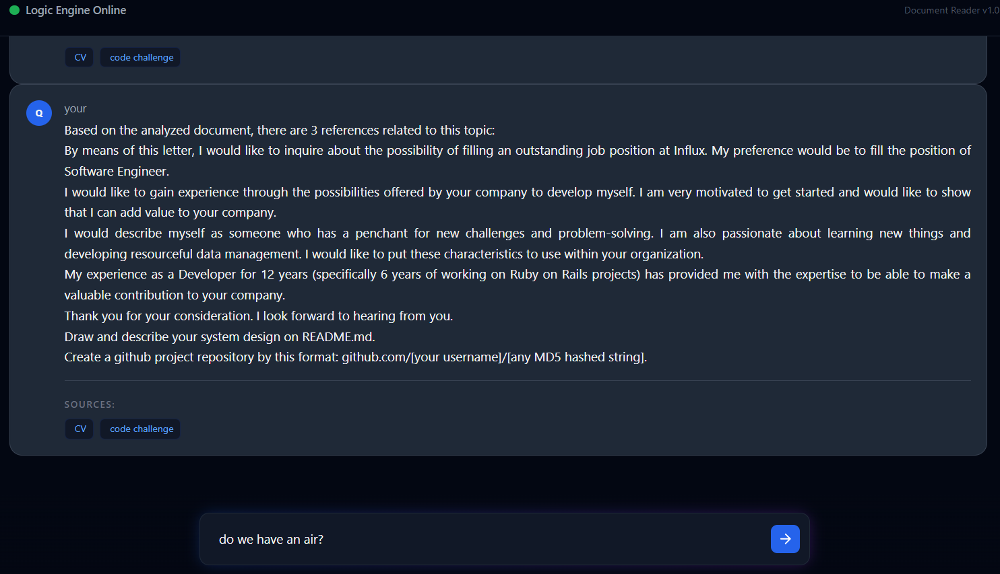

# README - DocuMind (Content Reader)
A Simple Content Reader that can answer all of your questions based on the content that you've uploaded. On this version, you can uploading document and ask any question based on the content of the document that has been uploaded. For the next version, it would be able to giving out the result more interactively.

# Requirement
  - PostgreSQL
  - Rails v. 7.0.8
  - Ruby v. 3.2.1

# Install Gem / Libraries
  - run ```bundle install```

# Set the ENV Variable
  - Create ```.env``` file in the root
  - Set value to variables ```POSTGRES_USER and POSTGRES_PASSWORD```

# Database Build
  - run ```bundle exec rake db:create```
  - run ```bundle exec rake db:migrate```

# Run Unit Test
  - run ```bundle exec rspec```

# Run Server on Local / Development Environment
  - make sure you are in the root of the folder project / repository
  - run ```rails s```
  - then you can open the web on the localhost url. example: http://localhost:3000

# Use the Feature
  1. Uploading the document. 
  

  - Insert the name of the document to indexing the document name.
  - Click "choose file" to choose the document file (only PDF, DOCX and TXT format are allowed to be uploaded).
  - Click "Upload Content" to submit the upload data.
  - The uploaded document name will be indexed on the list.

  2. Asking the questions.
  

  - Type the question on the text input.
  - Click the send button to submit the question.
  - The question will be answered.